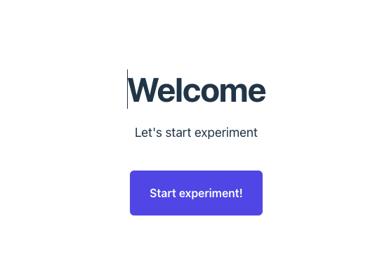
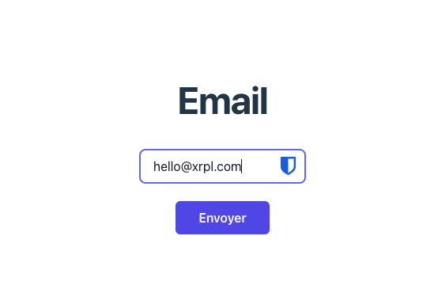
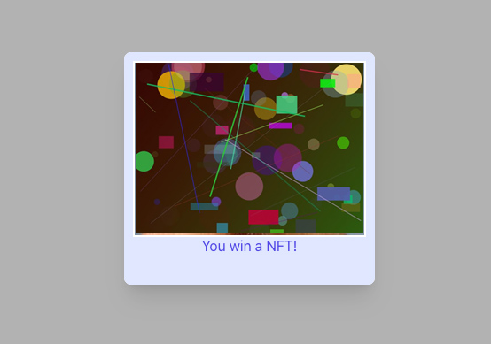
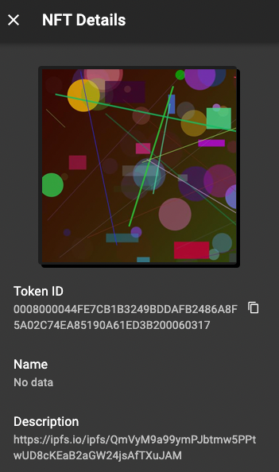

<h1 align="center">MetaCulture</h1>

Pendant le hackathon organisé par [XRPL Commons](https://www.xrpl-commons.org/) du 3 au 5 mai, une preuve de concept (PoC) a été développée pour une expérience numérique destinée à une exposition. 

L'objectif était de permettre aux visiteurs d'interagir avec une IA formée à partir des données de l'artiste présentant ses œuvres.

L'accès à cette IA se fait par le biais d'un NFT utilisé comme jeton d'accès. Une solution alternative a été mise en place pour permettre aux utilisateurs sans portefeuille numérique de se connecter à la plateforme via une simple adresse e-mail.

### Pré-requis :

- Make >= 3.81.
- Docker Compose >= v2.27.0


### Installation et configuration :

- Créer un fichier `.env` avec les paramètres suivants :

```
DOMAIN_NAME="localhost"
SENDING_EMAIL="noreply@meta-culture.fr"

JWT_SECRET="<secret>"

DB_NAME="meta_culture"
DB_USER="<secret>"
DB_PASSWORD="<secret>"
DB_ROOT_PASSWORD="<secret>"

XRP_WALLET_SEED="<secret>"
XAMAN_API_KEY="<secret>"
XAMAN_SECRET_KEY="<secret>"

PINATA_API_KEY="<secret>"

SMTP_HOST="smtp-relay.brevo.com"
SMTP_PORT="587"
SMTP_USER="<secret>"
SMTP_PASSWORD="<secret>"

XRPL_SERVER="wss://clio.altnet.rippletest.net:51233"

PREDIBASE_API_KEY="<secret>"
```


### Utilisation :

- `make build` : Construction du projet.
- `make up` : Lancement du projet.
- `make down` : Arret arrêt du projet .

### Démonstration :






---

### Contributeurs :


|  |  |  |  |
|:----------------------------------------------:|:------------------------------------------------:|:------------------------------------------------:|:-----------------------------------------------:|
| **[Robin](https://github.com/rgeral)**       | **[Echo](https://github.com/echo0117)**      | **[Florian](https://github.com/florian-a)**      | **[Vadim](https://github.com/valikpp)**         |